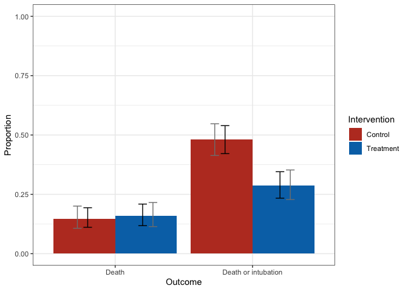
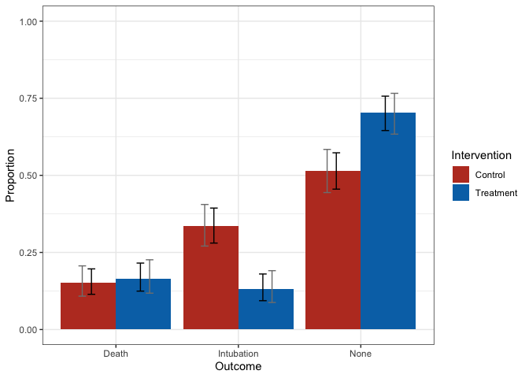

# R/`drord`

[](https://travis-ci.org/benkeser/drord)
[](https://ci.appveyor.com/project/benkeser/drord)
[](https://codecov.io/github/benkeser/drord?branch=master)
[](http://www.r-pkg.org/pkg/drord)
[](https://CRAN.R-project.org/package=drord)
[](http://www.repostatus.org/#active)
[](http://opensource.org/licenses/MIT)

> Doubly robust estimators of treatment effects for ordinal outcomes

**Author:** [David
Benkeser](https://www.sph.emory.edu/faculty/profile/#!dbenkes)

-----

## Description

`drord` is an R package that computes estimates of effect parameters
that are useful for evaluating efficacy of treatments on ordinal
outcomes. The effect estimates are *covariate-adjusted*, which means
they can be used in observational settings or to gain efficiency in
randomized trials.

The estimators implemented in the package are *doubly robust*, in that
they are based on working models for the probability of treatment as a
function of covariates (i.e., the propensity score) and for the CDF of
the outcome as a function of covariates in each treatment arm. The
latter working model is implemented via proportional odds models that
are fit in each treatment arm separately. Estimates based on these two
working models are combined to quantify the effects of the treatment on
the ordinal outcome in three different ways:

  - Difference in (weighted) means: The outcome levels are treated
    numerically, with each level possibly assigned a weight. The effect
    is defined as the difference in average outcomes.
  - Log odds ratio: The comparison describes the average log-odds
    (treatment level 1 versus 0) of the cumulative probability for each
    level of the outcome. See [Diaz et al.
    (2016)](https://doi.org/10.1111/biom.12450) for further discussion
    of this parameter.
  - Mann-Whitney: The probability that a randomly-selected individual
    receiving treatment 1 will have a larger outcome value than a
    randomly selected individual receiving treatment 0 (with ties
    assigned weight 1/2). See [Vermeulen et al.
    (2014)](https://onlinelibrary.wiley.com/doi/abs/10.1002/sim.6386)
    for further discussion.

-----

## Installation

<!-- 
Install the current stable release from
[CRAN](https://cran.r-project.org/) via


```r
install.packages("drord")
```
-->

A developmental release may be installed from GitHub via
[`devtools`](https://www.rstudio.com/products/rpackages/devtools/) with:

``` r
devtools::install_github("benkeser/drord")
```

-----

## Usage

Here we demonstrate calls to `drord` to compute treatment effects using
a simulated data set of COVID-19 outcomes in hospitalized patients.

``` r
library(drord)
#> drord: Doubly robust estimators for ordinal outcomes
#> Version: 1.0.0.9000

# load data
data(covid19)

# estimate treatment effects
fit <- drord(out = covid19$out, 
             covar = covid19[ , "age_grp", drop = FALSE],
             treat = covid19$treat)
# look at estimates
fit
#> $mann_whitney
#>       est  wald_cil  wald_ciu 
#> 0.5771119 0.5310573 0.6231666 
#> 
#> $log_odds
#>               est   wald_cil     wald_ciu
#> treat1 -1.2440885 -1.5162826 -0.971894388
#> treat0 -0.8926642 -1.1271181 -0.658210387
#> diff   -0.3514242 -0.6939617 -0.008886746
#> 
#> $weighted_mean
#>              est   wald_cil  wald_ciu
#> treat1 2.5390788 2.44680292 2.6313546
#> treat0 2.3635162 2.27899302 2.4480394
#> diff   0.1755625 0.05620023 0.2949248
```

There is a `plot` method included to visualize either the cumulative
distribution or probability mass function of outcomes.

``` r
# plot of CDF
cdf_plot <- plot(fit, dist = "cdf", 
                 treat_labels = c("Treatment", "Control"),
                 out_labels = c("Death", "Death or intubation"))
cdf_plot + ggsci::scale_fill_nejm()
```

<!-- -->

The black bars are pointwise 95% confidence intervals; the gray bars are
simultaneous 95% confidence intervals.

A similar plot can be made for the PMF.

``` r
# plot of PMF
pmf_plot <- plot(fit, dist = "pmf",
                 treat_labels = c("Treatment", "Control"),
                 out_labels = c("Death", "Intubation", "None"))
pmf_plot + ggsci::scale_fill_nejm()                 
```

## <!-- -->

## Issues

If you encounter any bugs or have any specific feature requests, please
[file an issue](https://github.com/benkeser/drord/issues).

-----

## Citation

After using the `drord` R package, please cite both of the following:

    @Manual{drordpackage,
      title = {drord: Doubly-Robust Estimators for Ordinal Outcomes},
      author = {David Benkeser},
      note = {R package version 1.0.0},
      doi = {TBA}
    }
    
    @article{benkeserdiazluedtke2020,
      title = {Improving Precision and Power in Randomized Trials for COVID-19 Treatments Using Covariate Adjustment, for Ordinal or Time to Event Outcomes},
      doi = {10.1101/2020.04.19.20069922},
      journal = {medRxiv: The Preprint Server for Health Sciences.}
    }

-----

## License

© 2020- [David
Benkeser](https://www.sph.emory.edu/faculty/profile/#!dbenkes)

The contents of this repository are distributed under the MIT license.
See below for details:

    The MIT License (MIT)
    
    Copyright (c) 2020- David Benkeser
    
    Permission is hereby granted, free of charge, to any person obtaining a copy
    of this software and associated documentation files (the "Software"), to deal
    in the Software without restriction, including without limitation the rights
    to use, copy, modify, merge, publish, distribute, sublicense, and/or sell
    copies of the Software, and to permit persons to whom the Software is
    furnished to do so, subject to the following conditions:
    
    The above copyright notice and this permission notice shall be included in all
    copies or substantial portions of the Software.
    
    THE SOFTWARE IS PROVIDED "AS IS", WITHOUT WARRANTY OF ANY KIND, EXPRESS OR
    IMPLIED, INCLUDING BUT NOT LIMITED TO THE WARRANTIES OF MERCHANTABILITY,
    FITNESS FOR A PARTICULAR PURPOSE AND NONINFRINGEMENT. IN NO EVENT SHALL THE
    AUTHORS OR COPYRIGHT HOLDERS BE LIABLE FOR ANY CLAIM, DAMAGES OR OTHER
    LIABILITY, WHETHER IN AN ACTION OF CONTRACT, TORT OR OTHERWISE, ARISING FROM,
    OUT OF OR IN CONNECTION WITH THE SOFTWARE OR THE USE OR OTHER DEALINGS IN THE
    SOFTWARE.
